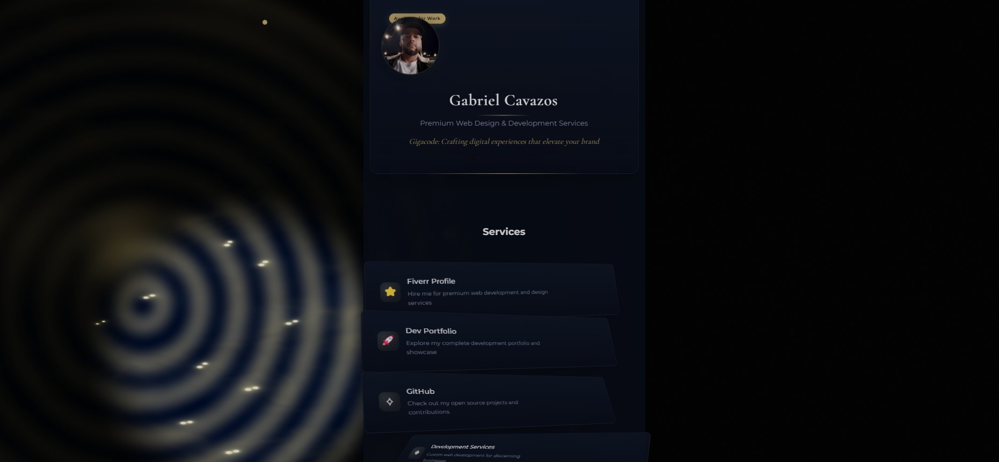

# Personal Link Tree

A premium, interactive personal link tree with elegant animations and a luxury aesthetic.



## Features

- **Interactive Welcome Screen**: Beautiful shader-based welcome screen with subtle gold particle effects
- **Premium Design**: Elegant dark theme with gold accents and professional typography
- **Smooth Animations**: GSAP-powered animations with staggered reveals and parallax effects
- **Responsive Layout**: Adapts perfectly to all screen sizes
- **Custom Cursor**: Elegant custom cursor with interactive hover effects
- **Link Cards**: Stylish cards for your important links with hover animations
- **Profile Section**: Clean profile display with status indicator
- **Service Categories**: Showcase your services or skills
- **Testimonials**: Display feedback from clients or colleagues

## Technologies Used

- HTML5, CSS3, JavaScript
- GSAP (GreenSock Animation Platform)
- Three.js for WebGL shaders
- AOS (Animate On Scroll)
- Lenis for smooth scrolling

## Getting Started

1. Clone the repository:
   ```
   git clone https://github.com/Gcavazo1/Personal_link_tree.git
   ```

2. Open `index.html` in your browser to view the project.

3. Customize the content in `script.js` to add your own links, services, and testimonials.

4. Replace `assets/profilePicture.jpg` with your own profile image.

## Customization

### Adding Links

Edit the `links` array in `script.js` to add your own links:

```javascript
const links = [
    {
        title: "Fiverr Profile",
        url: "https://www.fiverr.com/s/6Y217ER",
        icon: "⭐",
        description: "Hire me for premium web development and design services"
    },
    // Add more links here
];
```

### Changing Colors

The color scheme can be modified in the `:root` section of `styles.css`.

## Credits

- Created by Gabriel Cavazos
- Shader effects inspired by premium web experiences
- Icons and design elements carefully crafted for a luxury feel

## License

This project is available for personal use. For commercial use, please contact the author.

## Contact

- GitHub: [Gcavazo1](https://github.com/Gcavazo1)
- Portfolio: [Dev Portfolio](https://gcavazo1.github.io/GigaCode_Dev_Showcase_Website/)
- Fiverr: [Fiverr Profile](https://www.fiverr.com/s/6Y217ER)

## New Digital Consulting Page

The repository now includes a dedicated Digital Consulting page with these features:

- **Interactive Shader Effects**: Advanced WebGL shaders provide dynamic visual effects that respond to user scrolling and mouse interactions.
- **Scroll-Based Animations**: Page elements build themselves as the user scrolls down, creating an engaging experience.
- **Elegant Design**: Premium aesthetic with carefully selected typography, colors, and spacing.
- **Service Packages**: Showcases consulting offerings with attractive pricing and details.
- **Interactive Process Timeline**: Visual representation of the consulting process steps.
- **Client Testimonials**: Curated success stories to build trust and credibility.
- **Contact Form**: Integrated inquiry form for potential clients.

### Technical Features

- Uses Three.js for WebGL shader rendering
- Implements Lenis for smooth scrolling
- GSAP animations for element transitions
- Custom cursor effects for enhanced interactivity
- Fully responsive across all device sizes

Access the consulting page at `/consulting.html`. 